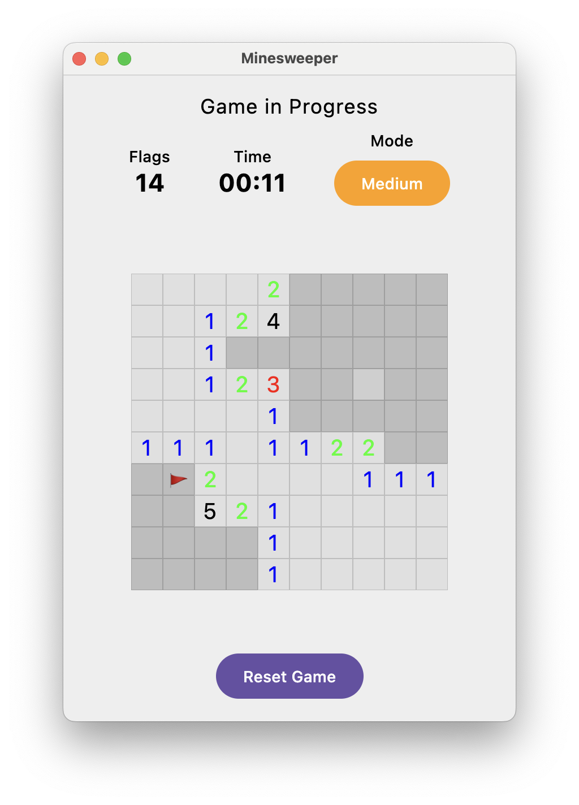
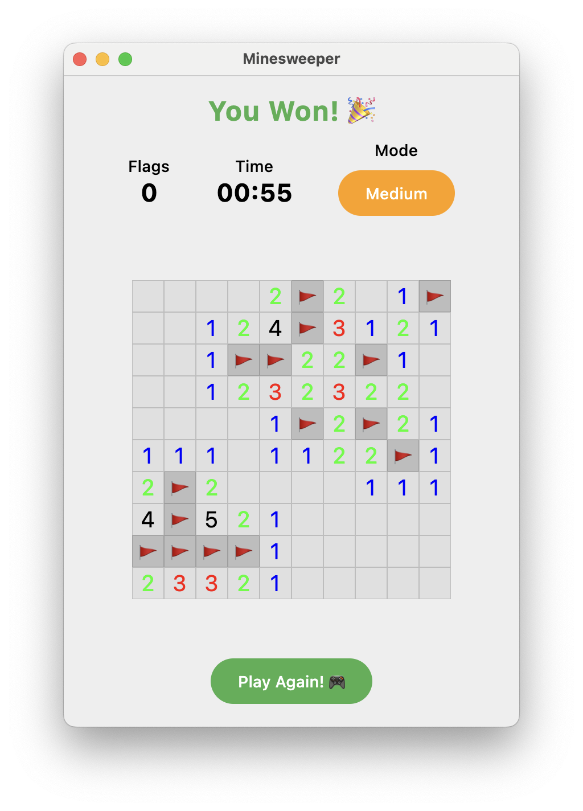
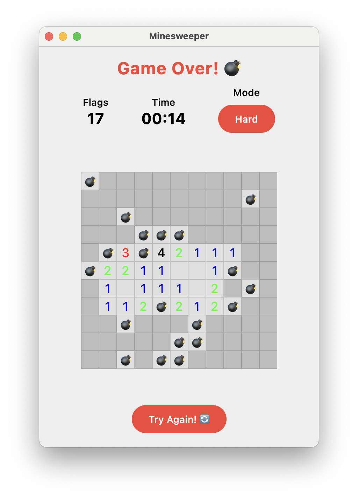
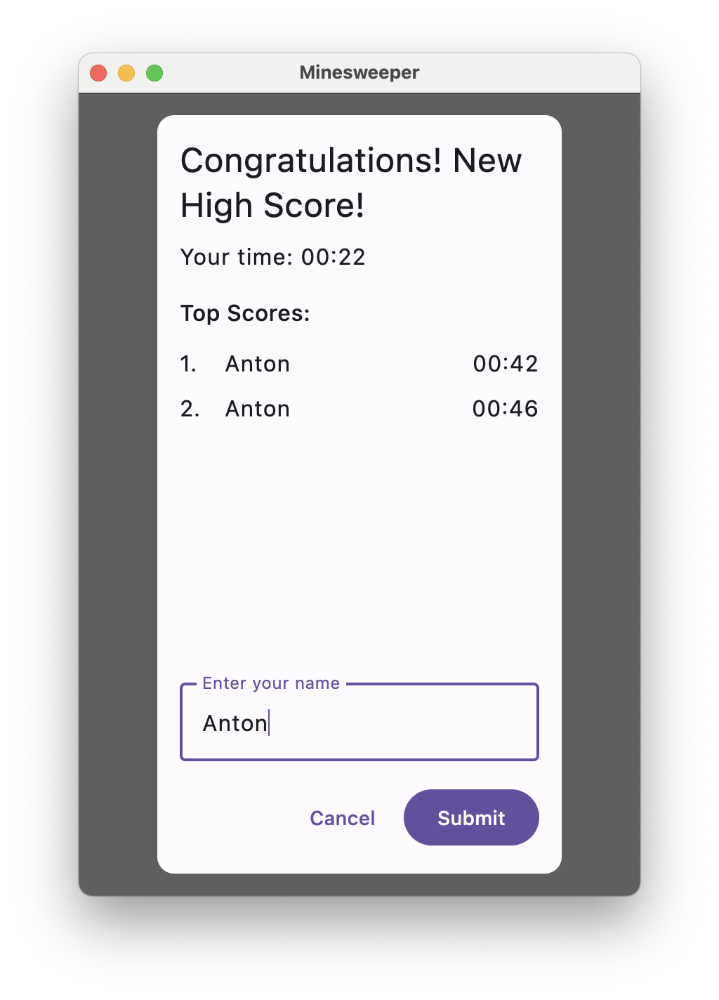

# Minesweeper

A modern implementation of the classic Minesweeper game using Kotlin and Compose Desktop.

## Features

- 🎮 Classic Minesweeper gameplay
- 🎯 Three difficulty levels: Beginner, Intermediate, and Expert
- ⏱️ Game timer that starts on first move
- 🏆 High scores system with persistent storage
- 📱 Mobile-friendly vertical layout
- 🖱️ Intuitive controls:
  - Left click to reveal cells
  - Long press to flag/unflag cells
  - Automatic flood fill for empty cells
- 🎨 Modern UI with:
  - Hover effects for cells
  - Color-coded numbers
  - Emoji indicators
  - Dynamic cell sizing
  - Responsive layout

## Screenshots

Here are some screenshots of the game in action:


|  |  |  |  |
|------------------------------------------------|------------------------------------------------|------------------------------------------------|------------------------------------------------|


These screenshots showcase the modern UI and gameplay experience.


### Building

```bash
./gradlew build
```

### Running

```bash
./gradlew run
```

## How to Play

1. Start the game by clicking any cell
2. Left click to reveal a cell
3. Long press to place/remove a flag
4. Numbers indicate adjacent mines
5. Flag all mines or reveal all safe cells to win
6. Beat the timer to get on the high scores list!

## Game Rules

- Each cell can be either empty, contain a mine, or show a number
- Numbers indicate how many mines are in the adjacent cells
- Use these numbers to deduce where mines are located
- Flag cells you believe contain mines
- Reveal all non-mine cells to win
- If you reveal a mine, game over!

## High Scores

- Top 10 scores are saved for each difficulty level
- Scores are based on completion time
- Enter your name when you achieve a high score
- Scores are saved between sessions
- High scores are stored in `high_scores.json`

## Technical Details

### Built With

- Kotlin 1.9.20
- Compose Desktop 1.5.11
- Material Design 3
- Kotlinx Serialization

### Project Structure

```
src/main/kotlin/minesweeper/
├── Main.kt           # UI and game rendering
├── Board.kt          # Game logic and state
├── GameViewModel.kt  # Game state management
├── HighScore.kt      # High score handling
└── Difficulty.kt     # Game difficulty settings
```

## License

This project is open source and available under the MIT License.
